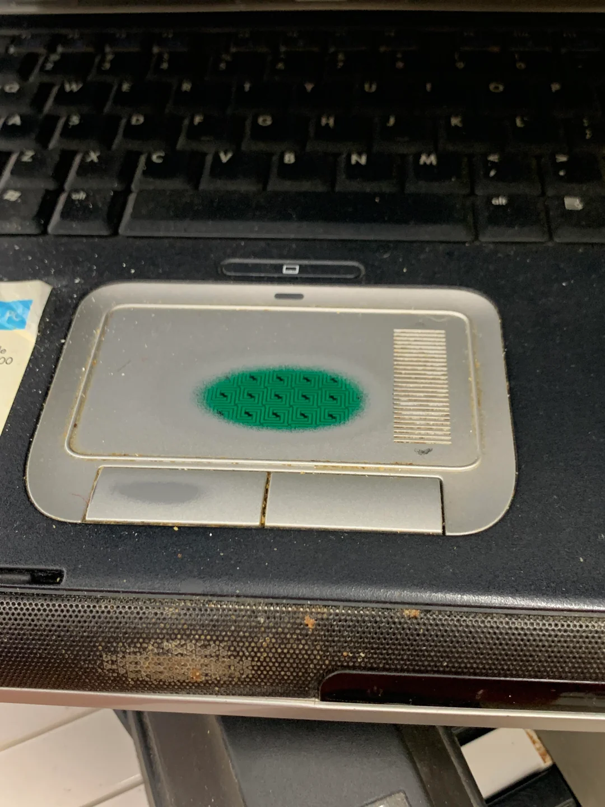

## Introduction

Did you ever notice how some places or refurbished devices have worn out spots on the keys, trackpad or casing? Makes you think those were used really hard but your device that you use doesn't have this issue? No, you're not using your device too little or not hard enough. It would just mean you don't moisturize your hands enough.

 Source: https://www.reddit.com/r/techsupportgore/comments/q84hav/this_beauty_of_a_touchpad_i_found_at_the_thrift/

## What and why?!

### Plastic things

There are many types of plastics in use. The material is an organic polymer which means it is built of big chains of smaller units. Example of a polymer would be your own DNA. [^polymers]
The most common synthetic polymers used in electronics are PET (polyethylene terephthalate), PC (polycarbonate), ABS (acrylonitrile butadiene styrene), PBT (polybutylene terephthalate), PVC (polyvinyl chloride) and some other polymers. The choice of material depends on cost, desired properties and appearance. Keyboards, mouses and most peripherals are in vast majority of cases made through the injection-moulding process where the hot, melted plastic is pumped into a mold[^injectionmolding] while plastic covered trackpads can additionally use photocurable resins for their surfrace [^trackpads].

### Hand lotion

Cosmetics meant to moisturise hands contain many chemical compounds but for the sake of this post we will focus only on specific types. Hand lotions can appear to absorb into the skin while still leaving some chemical resedue on things you touch, so it's worth keeping that in mind.

#### Solvents

They can range from harmless water to alcohols, like denaturated ethanol, isopropyl, benzyl alcohol

- Benzyl alcohol can degrade plastics, especially polysteryne [^benzylalcohol]
- ethanol, isopropyl while do not dissolve plastics effectively they can cause degradation ([crazing](https://en.wikipedia.org/wiki/Crazing)) or stiffening due to dissolution of plasticizers

#### Essential oils

The main source of fragrance of cosmetic products can be a big trouble of plastic devices. Undiluted oils can fully dissolve plastic cups they are poured into in the matter of minutes. [^soapqueen1]
Even in low concentration they can damage the surface or compromise structural integrity due to aromatic compounds that are often reactive with plastics. There are many cases of essential oils in air refresheners degrading car interiors. [^topgear1]

#### Occlusives - moisturizing agents

The most common one is petroleum jelly - vaseline. While it's pretty safe overall it can act as a plasticizer for PP slowly degrading the structure. Alone it won't destroy the plastic but could affect its structural properties making it easier for oils or solvents to dissolve the material.

This is just a couple of examples of certain compounds that could affect plastics. To be safe its worth using a lotion without any fruity smell that absorbs very quickly. And by not touching your devices while your hands are coated with the cream.

[^polymers]: https://en.wikipedia.org/wiki/Polymer
[^trackpads]: https://patents.google.com/patent/US20180373355A1/en
[^injectionmolding]: https://en.wikipedia.org/wiki/Injection_moulding
[^benzylalcohol]: https://www.jscc.edu/about-jackson-state/administration/safety-and-security/sds-files/benzyl-alcohol.pdf
[^soapqueen1]: https://www.soapqueen.com/bath-and-body-tutorials/tips-and-tricks/undiluted-fragrance-oils-molds/
[^topgear1]: https://www.topgear.com.ph/features/tip-sheet/car-perfume-damage-interior-a00013-20180209
