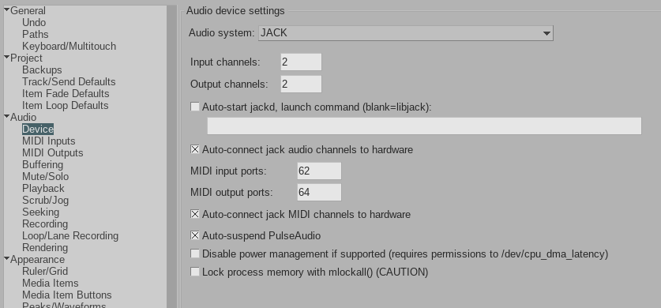
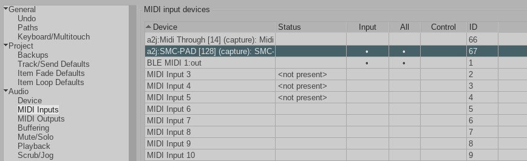

## Introduction

So, I’ve been learning music and Reaper, and naturally wanted one of those funky MIDI pads. Lately I've been buying a lot of stuff on aliexpress so I couldn't just pass up some of the cheap devices from there like M-VAVE SMC-PAD for 40 euro. The device uses BLE (Bluetooth Low Energy) MIDI. 


The only problem was no official support for Linux (duh) with Windows requiring a special driver. This did not discourage me as MacOS and iOS apparently worked with this device without any 3rd party driver. After getting it I quickly discovered bluetooth midi connection doesn't work and resources on the web were not helping.

## BlueZ

First thing I found was bluez support for midi devices hidden behind a compile flag `--enable-midi`. This wasn't an issue since bluez on OpenSUSE already [had this flag in the bluez package from the repo](https://build.opensuse.org/projects/Base:System/packages/bluez/files/bluez.spec#262)

## Logs, logs everywhere

Since `dmesg` wasn't showing anything that would guide me to the root of the problem I used `journalctl -f` ran as the root to see if anything interesting would be logged as I connect the device.

I got errors about ALSA not being able to read its configuration as the bluetoothd.

```
bluetoothd[33915]: ALSA lib conf.c:4583:(snd_config_update_r) Cannot access file /usr/share/alsa/alsa.conf
bluetoothd[33915]: ALSA lib seq.c:1011:(snd_seq_open_noupdate) Unknown SEQ default
bluetoothd[33915]: profiles/midi/midi.c:midi_accept() Could not open ALSA Sequencer: No such file or directory (-2)
bluetoothd[33915]: src/service.c:service_accept() MIDI GATT Driver profile accept failed for XX:XX:XX:XX:XX:XX
```

`/usr/share/alsa` by itself was readable only for root.

Quick peek into the bluetooth service file showed it's very restrictive. As I should expect from OpenSUSE.

```
# Filesystem lockdown
ProtectHome=true
ProtectSystem=strict
```

It's seems locked down, so I started playing around getting lesser permissions and exceptions by modifying systemd services, doing `systemd daemon-reload` and `systemd restart bluetooth`

```
# /etc/systemd/system/bluetooth.service.d/override.conf
[Service]
ProtectSystem=full
BindReadOnlyPaths=/usr/share/alsa
DeviceAllow=/dev/snd/seq rw
ReadWritePaths=/dev/snd/seq
```

It wasn't helping... but then I remembered I have selinux now. It could be related to the issue. Doing `grep bluetoothd /var/log/audit/audit.log` returned a lot of issues related to alsa.

Based on that I generated a selinux module that will fix those errors using `grep bluetoothd /var/log/audit/audit.log | audit2allow -M bluetoothd_midi` and installed it with `semodule -i bluetoothd_midi.pp`. Loading newly created module fixed my issues with bluetoothd running ALSA not having access to ALSA configs.

That got rid of errors in bluetoothd service after connecting the device to my machine.

## Bluetooth midi visibility for Reaper

I couldn't get Reaper to see my midi device yet. Even when ALSA sees your device (aconnect -i), Reaper might not. That’s because BLE MIDI shows up as an ALSA sequencer port, not a raw device. PulseAudio doesn't handle MIDI and I couldn't change the audio system in Reaper to ALSA, so I tried JACK.



In order to have a bridge between ALSA sequencing MIDI to JACK MIDI I ran `a2jmidid -e` and checked the MIDI settings in Reaper.



Jackpot! After all those steps Repear starter receiving and reading signal from the Bluetooth MIDI device while still using the pipewire-pulseaudio as the system sound device. 

Did this post help you? [Feel free to buy me a coffee](https://ko-fi.com/domi_zip)


